# awesome-stable-diffusion-prompts

# Prompts

## [001]a girl, wearing a tie

Contributed by: [@xutongbao](http://chat.xutongbao.top)

> a girl, wearing a tie, cupcake in her hands, school, indoors, (soothing tones:1.25), (hdr:1.25), (artstation:1.2), dramatic, (intricate details:1.14), (hyperrealistic 3d render:1.16), (filmic:0.55), (rutkowski:1.1), (faded:1.3)

> Negative prompt: (deformed, distorted, disfigured:1.3), poorly drawn, bad anatomy, wrong anatomy, extra limb, missing limb, floating limbs, (mutated hands and fingers:1.4), disconnected limbs, mutation, mutated, ugly, disgusting, blurry, amputation

> Steps: 20, Sampler: Euler a, CFG scale: 7, Seed: 3451626704, Face restoration: CodeFormer, Size: 512x910, Model hash: b4391b7978, Model: deliberate_v2

## [002]1 chinese gril with headphones

Contributed by: [@xutongbao](http://chat.xutongbao.top)

> 1 chinese gril with headphones, natural skin texture, 24mm, 4k textures, soft cinematic light, adobe lightroom, photolab, hdr, intricate, elegant, highly detailed, sharp focus, ((((cinematic look)))), soothing tones, insane details, intricate details, hyperdetailed, low contrast, soft cinematic light, dim colors, exposure blend, hdr, faded

> Negative prompt: (deformed, distorted, disfigured:1.3), poorly drawn, bad anatomy, wrong anatomy, extra limb, missing limb, floating limbs, (mutated hands and fingers:1.4), disconnected limbs, mutation, mutated, ugly, disgusting, blurry, amputation

> Steps: 20, Sampler: Euler a, CFG scale: 7, Seed: 1154148374, Face restoration: CodeFormer, Size: 512x910, Model hash: b4391b7978, Model: deliberate_v2

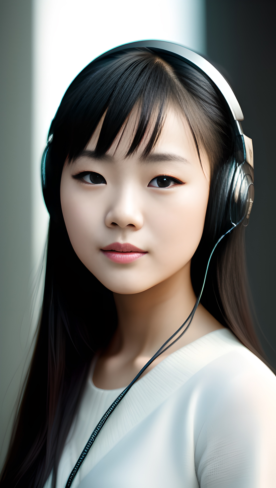

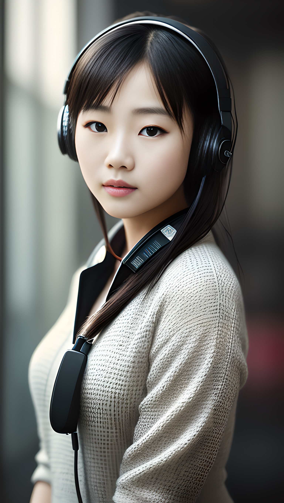
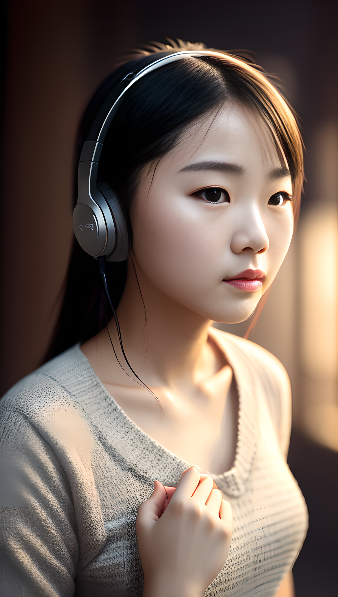
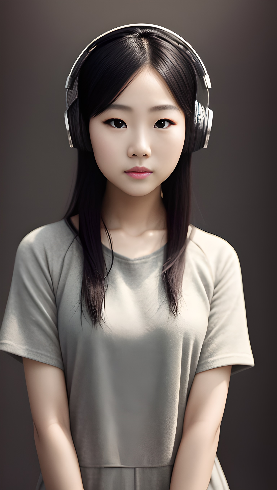
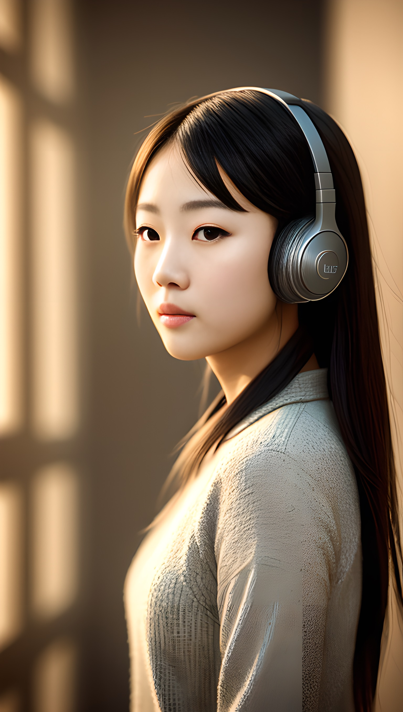

## [003]a girl, wearing a white sling

Contributed by: [@xutongbao](http://chat.xutongbao.top)

> a girl, wearing a white sling, in bed,sexy, (soothing tones:1.25), (hdr:1.25), (artstation:1.2), dramatic, (intricate details:1.14), (hyperrealistic 3d render:1.16), (filmic:0.55), (rutkowski:1.1), (faded:1.3)

> Negative prompt: (deformed, distorted, disfigured:1.3), poorly drawn, bad anatomy, wrong anatomy, extra limb, missing limb, floating limbs, (mutated hands and fingers:1.4), disconnected limbs, mutation, mutated, ugly, disgusting, blurry, amputation

> Steps: 20, Sampler: Euler a, CFG scale: 7, Seed: 1534910165, Face restoration: CodeFormer, Size: 512x910, Model hash: b4391b7978, Model: deliberate_v2

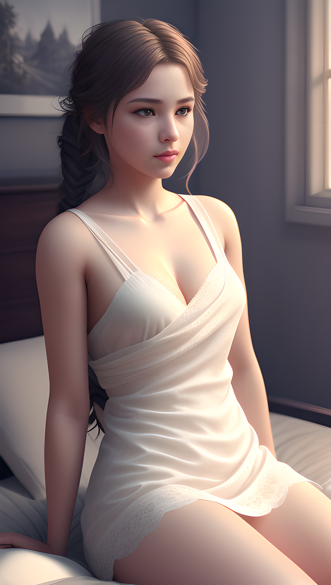

## [004]a girl, wearing a white sling, in bed,sexy posture

Contributed by: [@xutongbao](http://chat.xutongbao.top)

> a girl, wearing a white sling, in bed,sexy posture, (soothing tones:1.25), (hdr:1.25),(intricate details:1.14), (hyperrealistic 3d render:1.16), (filmic:0.55), (rutkowski:1.1)

> Negative prompt: (deformed, distorted, disfigured:1.3), poorly drawn, bad anatomy, wrong anatomy, extra limb, missing limb, floating limbs, (mutated hands and fingers:1.4), disconnected limbs, mutation, mutated, ugly, disgusting, blurry, amputation

> Steps: 20, Sampler: Euler a, CFG scale: 7, Seed: 1258874699, Face restoration: CodeFormer, Size: 512x910, Model hash: b4391b7978, Model: deliberate_v2

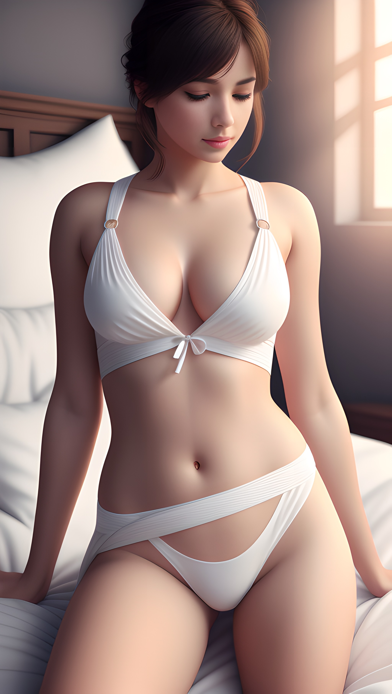

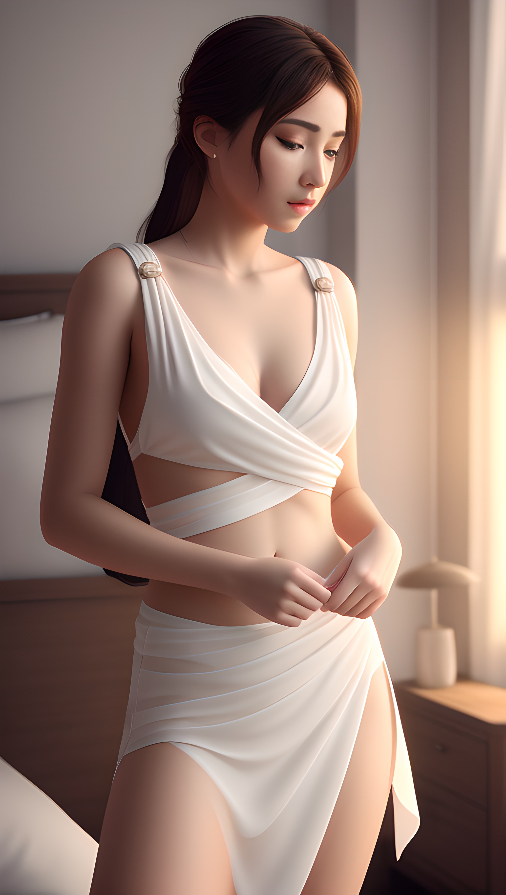
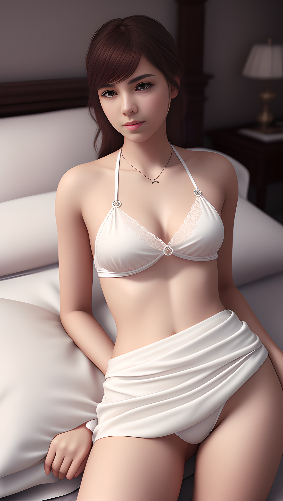
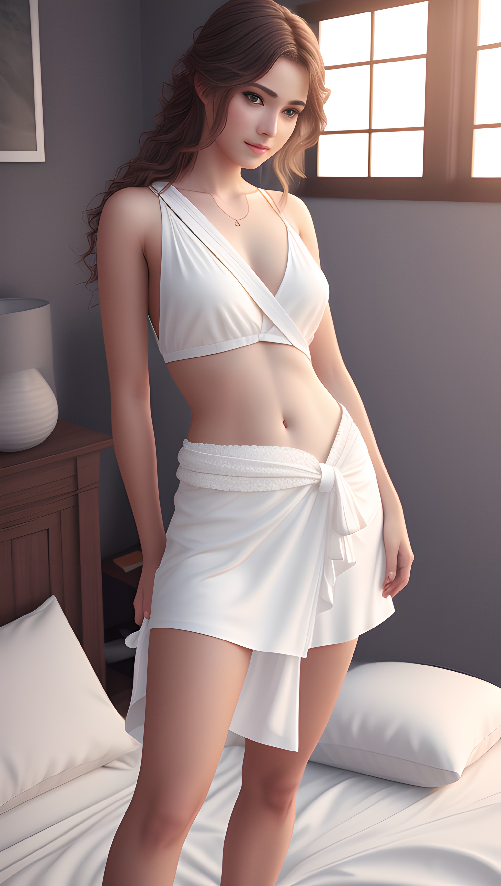

## [005]a woman, wearing a tie

Contributed by: [@xutongbao](http://chat.xutongbao.top)

> a woman, wearing a tie, smile,school, in classroom,blackboard, open eyes, sexy,(soothing tones:1.25), (hdr:1.25), (artstation:1.2), dramatic, (intricate details:1.14), (hyperrealistic 3d render:1.16), (filmic:0.55), (rutkowski:1.1), (faded:1.3)

> (deformed, distorted, disfigured:1.3),(unclear eyes:1.331), poorly drawn, bad anatomy, wrong anatomy, extra limb, missing limb, floating limbs, (mutated hands and fingers:1.4), disconnected limbs, mutation, mutated, ugly, disgusting, blurry, amputation

> Steps: 20, Sampler: Euler a, CFG scale: 7, Seed: 96064523, Face restoration: CodeFormer, Size: 640x360, Model hash: b4391b7978, Model: deliberate_v2

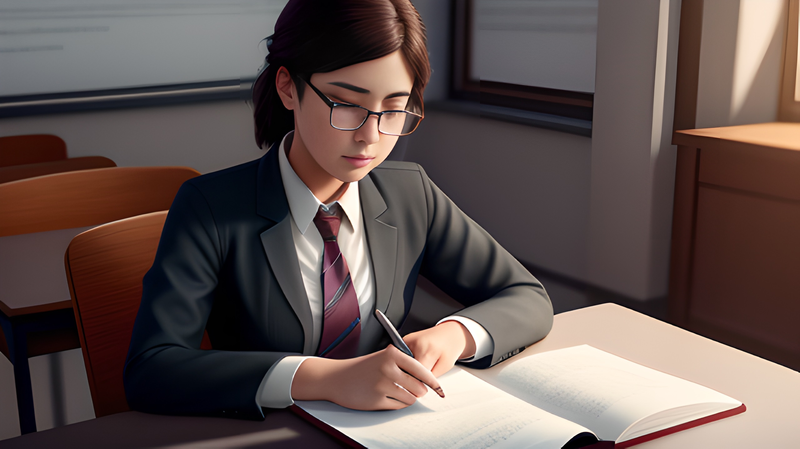

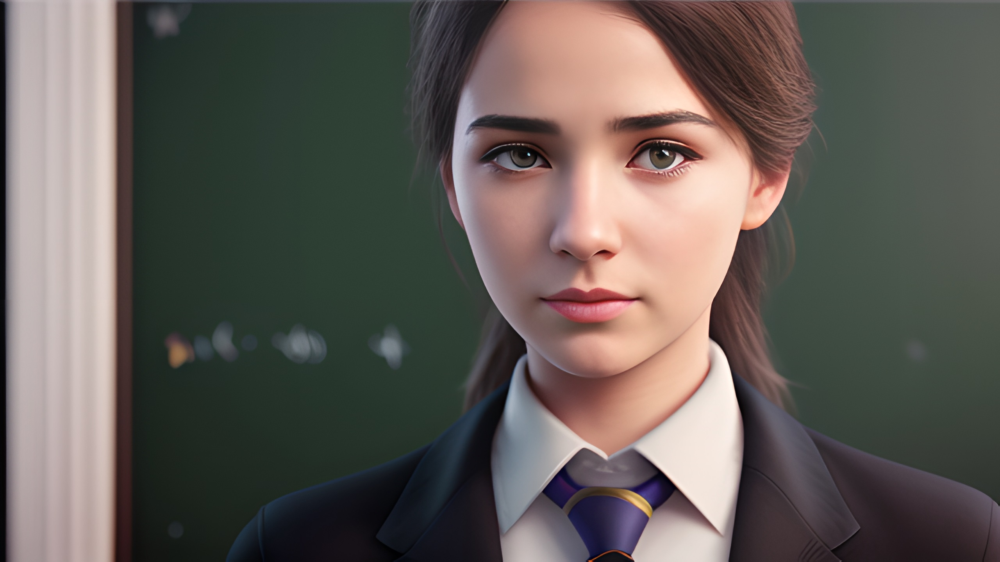
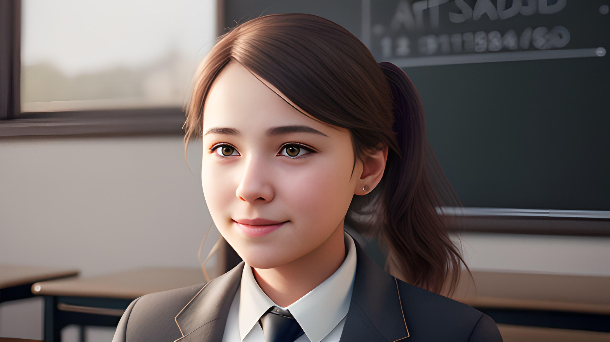
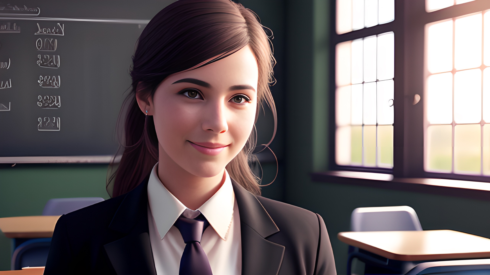

## [006]a beautiful woman,chinese

Contributed by: [@xutongbao](http://chat.xutongbao.top)

> a beautiful woman,chinese,sexy, wearing a white shirt, smile, in classroom,blackboard,a book in her hands,open eyes,natural skin texture, 24mm, 4k textures, soft cinematic light, adobe lightroom, photolab, intricate, elegant, highly detailed, sharp focus (soothing tones:1.25), (hdr:1.25), (artstation:1.2), dramatic, (intricate details:1.14), (hyperrealistic 3d render:1.16), (filmic:0.55), (rutkowski:1.1), (faded:1.3),((((cinematic look)))), insane details, low contrast, exposure blend

> (deformed, distorted, disfigured:1.3),(unclear eyes:1.331), poorly drawn, bad anatomy, wrong anatomy, extra limb, missing limb, floating limbs, (mutated hands and fingers:1.4), disconnected limbs, mutation, mutated, ugly, disgusting, blurry, amputation

> Steps: 20, Sampler: Euler a, CFG scale: 7, Seed: 1000256773, Face restoration: CodeFormer, Size: 512x910, Model hash: b4391b7978, Model: deliberate_v2

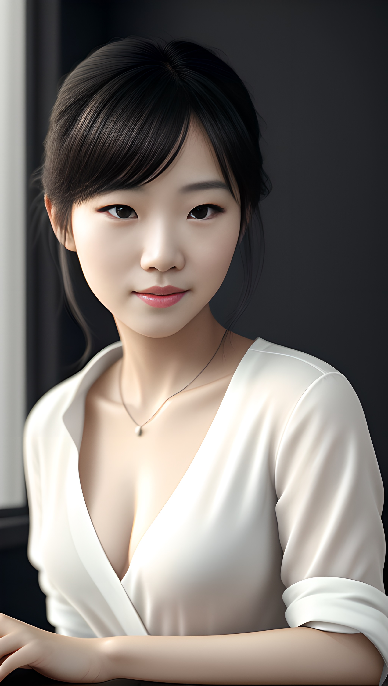

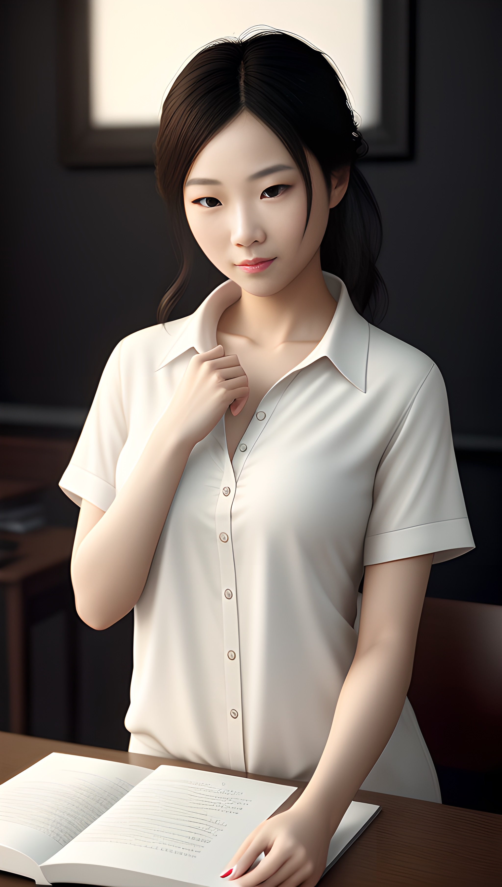

## [007]a girl, <lora:mix4:0.7>

Contributed by: [@xutongbao](http://chat.xutongbao.top)

> <lora:mix4:0.7>, mix4, <lora:20d_new:0.5>, 20d, solo, long_hair, wearing a white shirt, high_heels,full_body, look_at_viewer, (8k, RAW photo, best quality, masterpiece:1.2), highly detailed,(realistic, photo-realistic:1.37), professional lighting, photon mapping, radiosity, physically-based rendering,natural skin texture, 24mm, 4k textures, soft cinematic light, adobe lightroom, photolab, intricate, elegant, highly detailed, sharp focus (soothing tones:1.25), (hdr:1.25), (artstation:1.2), dramatic, (intricate details:1.14), (hyperrealistic 3d render:1.16), (filmic:0.55), (rutkowski:1.1), (faded:1.3),((((cinematic look)))), insane details, low contrast, exposure blend

> paintings, sketches, (worst quality:2), (low quality:2), (normal quality:2), lowres, normal quality, ((monochrome)), ((grayscale)), skin spots, acnes, skin blemishes, age spot, glans, (worst quality:2), (low quality:2), (normal quality:2), lowres, normal quality, ((monochrome)), ((grayscale)), skin spots, acnes, skin blemishes, age spot, glans,extra fingers,fewer fingers,strange fingers,bad hand (low quality, worst quality:1.4), (bad_prompt:0.8), (monochrome), (greyscale)

> Steps: 20, Sampler: DPM++ SDE Karras, CFG scale: 7, Seed: 3279921955, Face restoration: CodeFormer, Size: 512x910, Model hash: d819c8be6b, Model: majicmixRealistic_v4

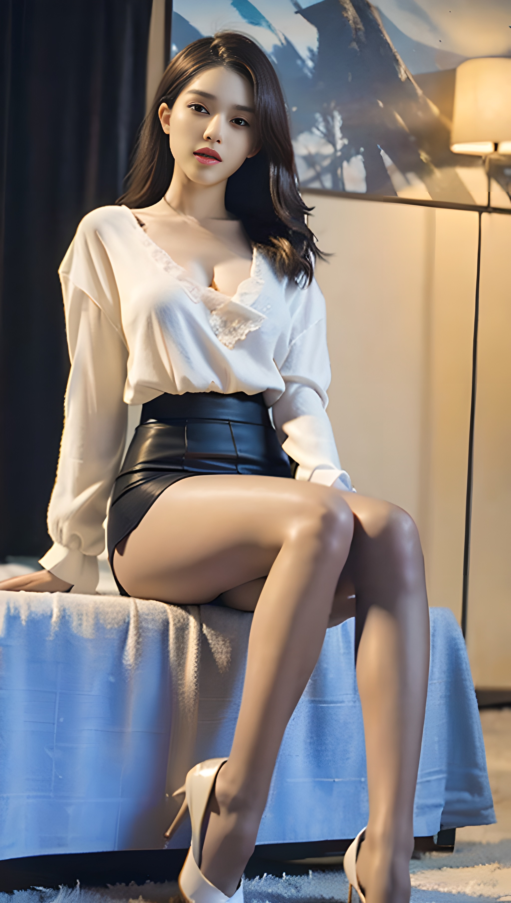

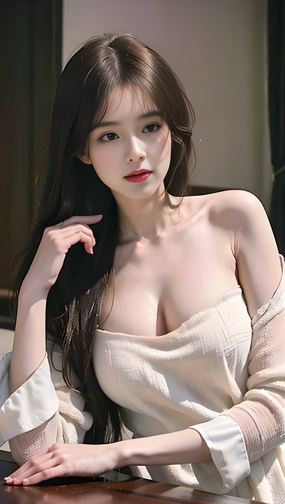
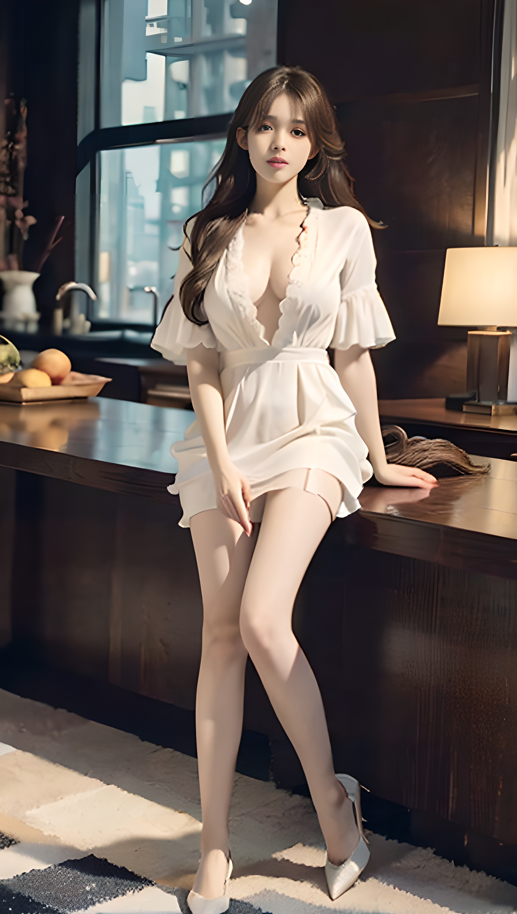

## [008]a girl, <lora:nwsjmajic-10:0.6>

Contributed by: [@xutongbao](http://chat.xutongbao.top)

> <lora:nwsjmajic-10:0.6>,a beautiful woman,chinese,sexy, wearing a white shirt, smile, in classroom,blackboard,a book in her hands,open eyes,natural skin texture, 24mm, 4k textures, soft cinematic light, adobe lightroom, photolab, intricate, elegant, highly detailed, sharp focus (soothing tones:1.25), (hdr:1.25), (artstation:1.2), dramatic, (intricate details:1.14), (hyperrealistic 3d render:1.16), (filmic:0.55), (rutkowski:1.1), (faded:1.3),((((cinematic look)))), insane details, low contrast, exposure blend,(upper_body:1.4), insane details, low contrast, exposure blend

> (low quality:1.3), (worst quality:1.3),(monochrome:0.8),(deformed:1.3),(malformed hands:1.4),(poorly drawn hands:1.4),(mutated fingers:1.4),(bad anatomy:1.3),(extra limbs:1.35),(poorly drawn face:1.4)  (bad_prompt_version2:1.1) (bad-hands-5:1.2) (verybadimagenegative_v1.3:1.2),(deformed, distorted, disfigured:1.3),(unclear eyes:1.331), poorly drawn, bad anatomy, wrong anatomy, extra limb, missing limb, floating limbs, (mutated hands and fingers:1.4), disconnected limbs, mutation, mutated, ugly, disgusting, blurry, amputation

> Steps: 20, Sampler: DPM++ SDE Karras, CFG scale: 7, Seed: 3007444509, Face restoration: CodeFormer, Size: 512x910, Model hash: b4391b7978, Model: deliberate_v2

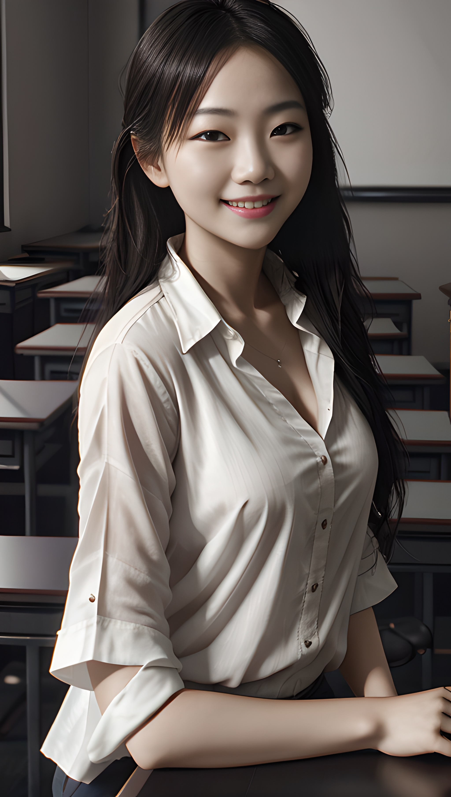

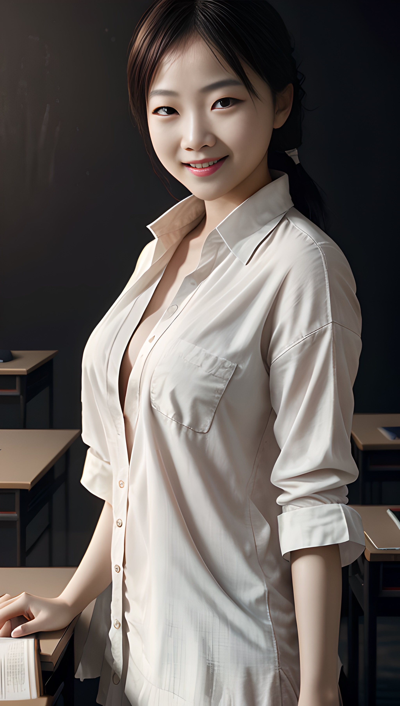
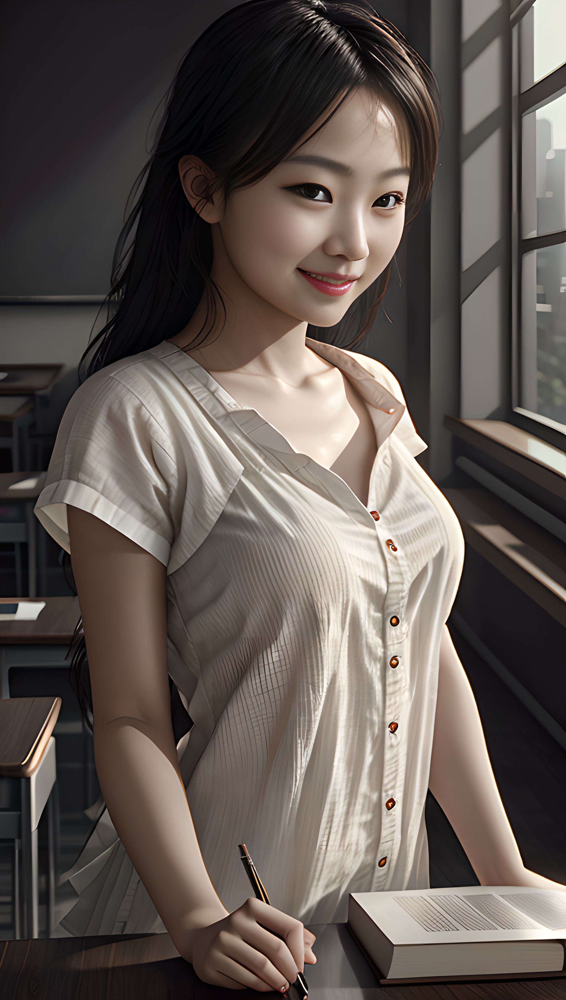
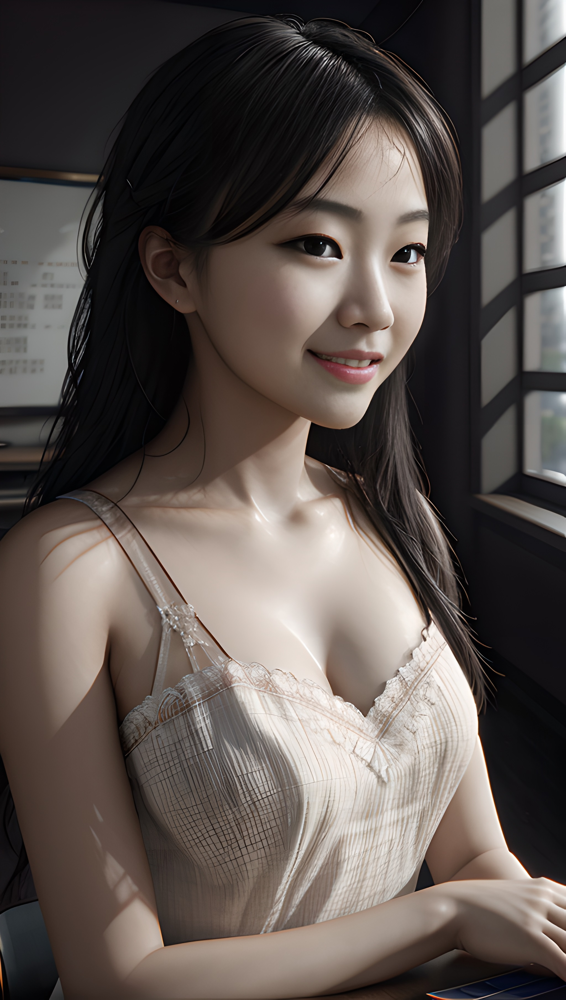
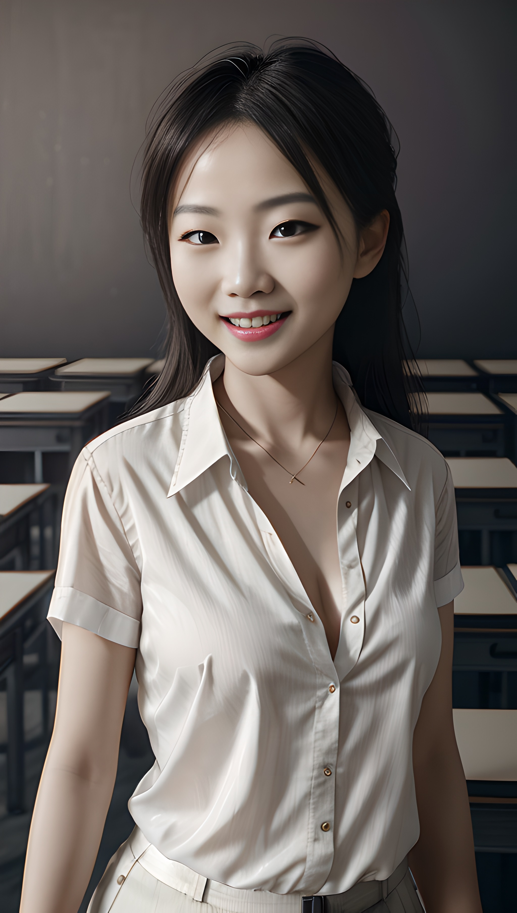
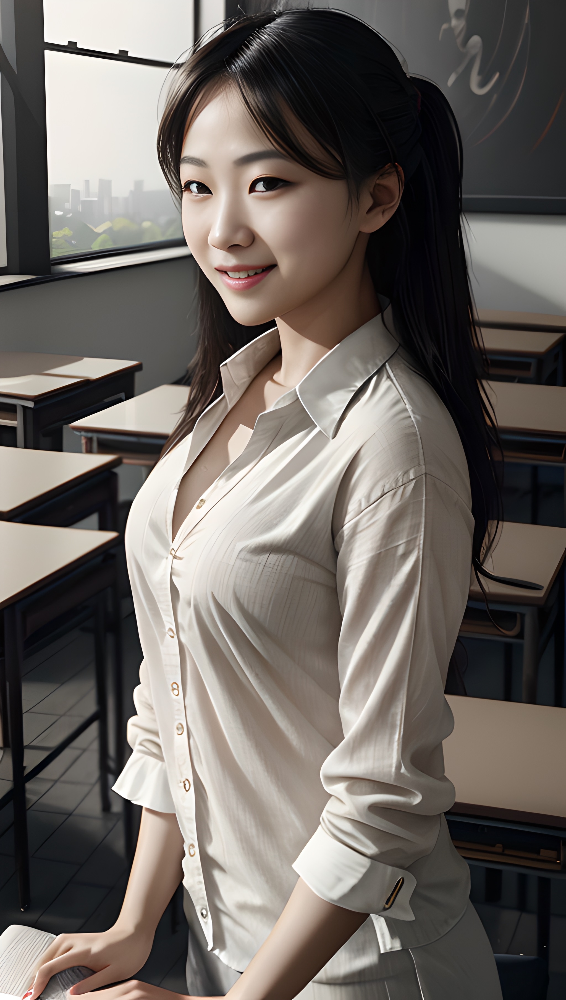

## [009]a beautiful woma, <lora:nwsjmajic-10:0.6>

Contributed by: [@xutongbao](http://chat.xutongbao.top)

> <lora:nwsjmajic-10:0.6>,a beautiful woman,( an adult vibrator  in her hand:1.5),chinese,sexy, wearing white bikini, smile, (lie in bed:1.3),open eyes,natural skin texture, 24mm, 4k textures, soft cinematic light, adobe lightroom, photolab, intricate, elegant, highly detailed, sharp focus (soothing tones:1.25), (hdr:1.25), dramatic, (intricate details:1.14), (hyperrealistic 3d render:1.16), (filmic:0.55), (rutkowski:1.1), (faded:1.3),((((cinematic look)))), insane details, low contrast, exposure blend,(full_body:1.4), 

> (low quality:1.3), (worst quality:1.3),(monochrome:0.8),(deformed:1.3),(malformed hands:1.4),(poorly drawn hands:1.4),(mutated fingers:1.4),(bad anatomy:1.3),(extra limbs:1.35),(poorly drawn face:1.4)  (bad_prompt_version2:1.1) (bad-hands-5:1.2) (verybadimagenegative_v1.3:1.2),(deformed, distorted, disfigured:1.3),(unclear eyes:1.331), poorly drawn, bad anatomy, wrong anatomy, extra limb, missing limb, floating limbs, (mutated hands and fingers:1.4), disconnected limbs, mutation, mutated, ugly, disgusting, blurry, amputation

> Steps: 20, Sampler: DPM++ SDE Karras, CFG scale: 7, Seed: 2517605322, Face restoration: CodeFormer, Size: 512x910, Model hash: b4391b7978, Model: deliberate_v2

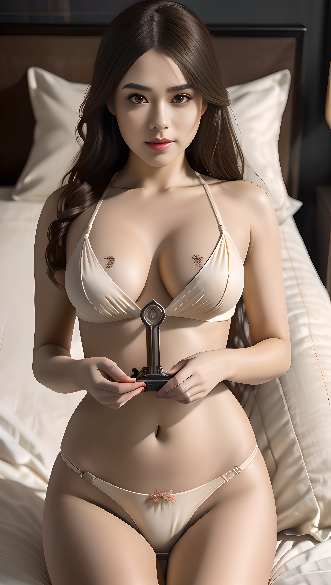

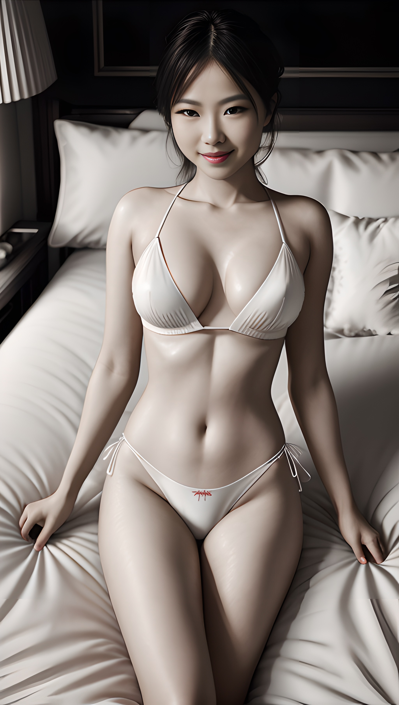
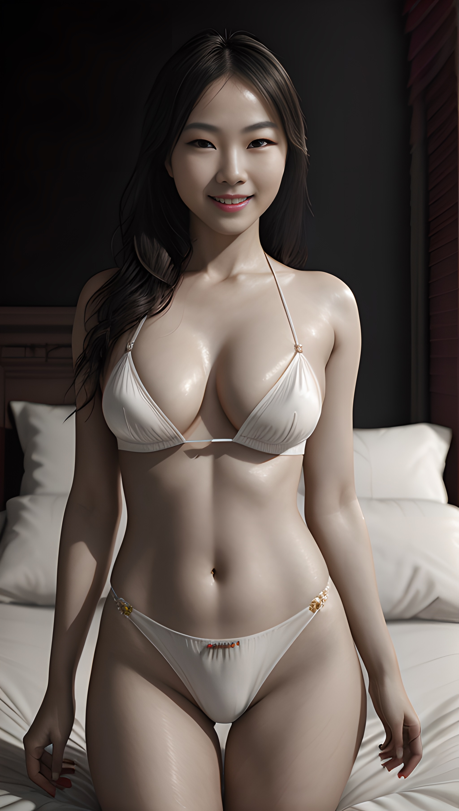
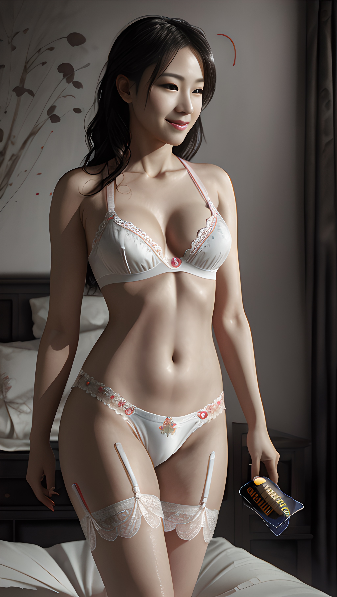
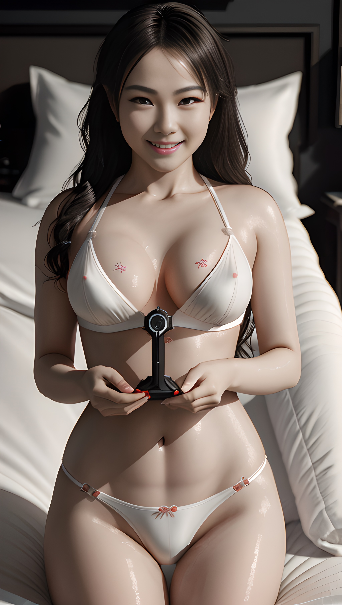

## [010]a beautiful woma, <lora:nwsjmajic-10:0.6>

Contributed by: [@xutongbao](http://chat.xutongbao.top)

> <lora:nwsjmajic-10:0.6>,a beautiful woman,sitting by window with headphones on, wearing an orange sweater,  wearing  yellow sweaters,soft lips,smile, beach blonde hair,open eyes,natural skin texture, (full_body:1.4),24mm, 4k textures, soft cinematic light, adobe lightroom, photolab, intricate, elegant, highly detailed, sharp focus (soothing tones:1.25), (hdr:1.25), dramatic, (intricate details:1.14), (hyperrealistic 3d render:1.16), (filmic:0.55), (rutkowski:1.1), (faded:1.3),((((cinematic look)))), insane details, low contrast, exposure blend,(full_body:1.4), 

> (low quality:1.3), (worst quality:1.3),(monochrome:0.8),(deformed:1.3),(malformed hands:1.4),(poorly drawn hands:1.4),(mutated fingers:1.4),(bad anatomy:1.3),(extra limbs:1.35),(poorly drawn face:1.4)  (bad_prompt_version2:1.1) (bad-hands-5:1.2) (verybadimagenegative_v1.3:1.2),(deformed, distorted, disfigured:1.3),(unclear eyes:1.331), poorly drawn, bad anatomy, wrong anatomy, extra limb, missing limb, floating limbs, (mutated hands and fingers:1.4), disconnected limbs, mutation, mutated, ugly, disgusting, blurry, amputation

> Steps: 20, Sampler: DPM++ SDE Karras, CFG scale: 7, Seed: 2517605322, Face restoration: CodeFormer, Size: 512x910, Model hash: b4391b7978, Model: deliberate_v2

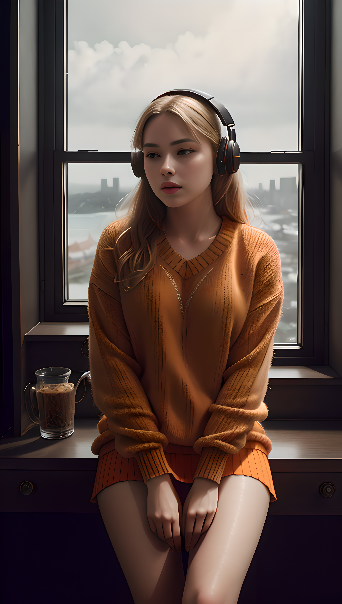

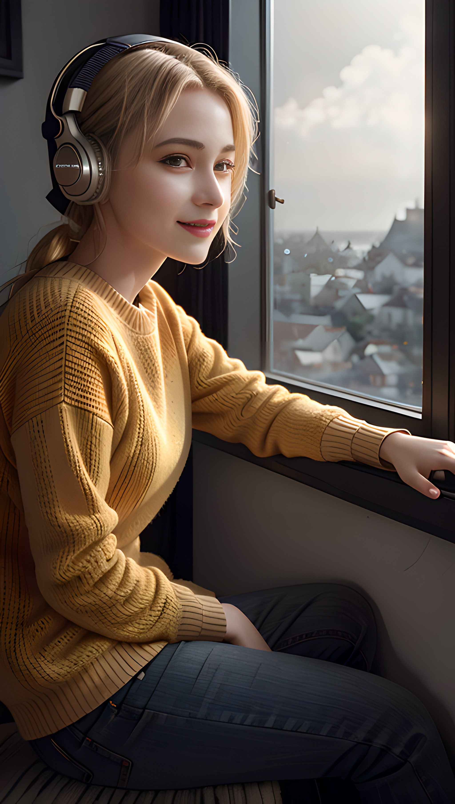

## [011]a beautiful woma, <lora:nwsjmajic-10:0.6>

Contributed by: [@xutongbao](http://chat.xutongbao.top)

> <lora:nwsjmajic-10:0.6>,a beautiful woman, standing by the car, auto show,wearing a white sling,sexy posture,soft lips,smile, beach blonde hair,open eyes,natural skin texture, (full_body:1.4),24mm, 4k textures, soft cinematic light, adobe lightroom, photolab, intricate, elegant, highly detailed, sharp focus (soothing tones:1.25), (hdr:1.25), dramatic, (intricate details:1.14), (hyperrealistic 3d render:1.16), (filmic:0.55), (rutkowski:1.1), (faded:1.3),((((cinematic look)))), insane details, low contrast, exposure blend,(full_body:1.4),

> Negative prompt: (low quality:1.3), (worst quality:1.3),(monochrome:0.8),(deformed:1.3),(malformed hands:1.4),(poorly drawn hands:1.4),(mutated fingers:1.4),(bad anatomy:1.3),(extra limbs:1.35),(poorly drawn face:1.4) (bad_prompt_version2:1.1) (bad-hands-5:1.2) (verybadimagenegative_v1.3:1.2),(deformed, distorted, disfigured:1.3),(unclear eyes:1.331), poorly drawn, bad anatomy, wrong anatomy, extra limb, missing limb, floating limbs, (mutated hands and fingers:1.4), disconnected limbs, mutation, mutated, ugly, disgusting, blurry, amputation

> Steps: 20, Sampler: Euler a, CFG scale: 7, Seed: 2394465936, Face restoration: CodeFormer, Size: 512x910, Model hash: b4391b7978, Model: deliberate_v2

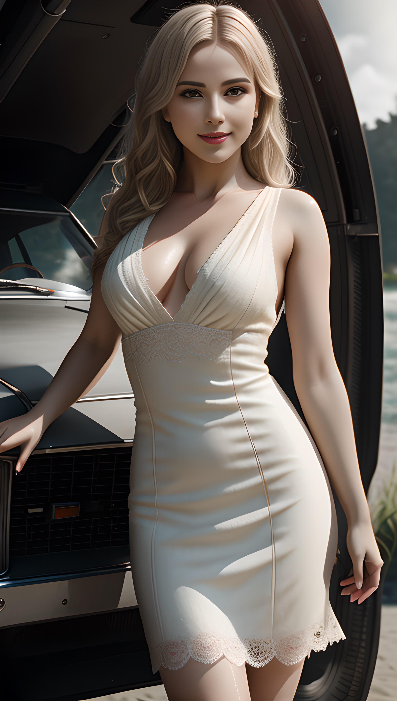

## [012]a male worker,chinese

Contributed by: [@xutongbao](http://chat.xutongbao.top)

> a male worker,chinese, repairing the car , wearing blue work coveralls, smile, in the workshop, wrench in their hands, beach blonde hair,open eyes,natural skin texture, (full_body:1.4),24mm, 4k textures, soft cinematic light, adobe lightroom, photolab, intricate, elegant, highly detailed, sharp focus (soothing tones:1.25), (hdr:1.25), dramatic, (intricate details:1.14), (hyperrealistic 3d render:1.16), (filmic:0.55), (rutkowski:1.1), (faded:1.3),((((cinematic look)))), insane details, low contrast, exposure blend,(full_body:1.4),

> Negative prompt: (low quality:1.3), (worst quality:1.3),(monochrome:0.8),(deformed:1.3),(malformed hands:1.4),(poorly drawn hands:1.4),(mutated fingers:1.4),(bad anatomy:1.3),(extra limbs:1.35),(poorly drawn face:1.4) (bad_prompt_version2:1.1) (bad-hands-5:1.2) (verybadimagenegative_v1.3:1.2),(deformed, distorted, disfigured:1.3),(unclear eyes:1.331), poorly drawn, bad anatomy, wrong anatomy, extra limb, missing limb, floating limbs, (mutated hands and fingers:1.4), disconnected limbs, mutation, mutated, ugly, disgusting, blurry, amputation

> Steps: 20, Sampler: Euler a, CFG scale: 7, Seed: 2394465936, Face restoration: CodeFormer, Size: 512x910, Model hash: b4391b7978, Model: deliberate_v2

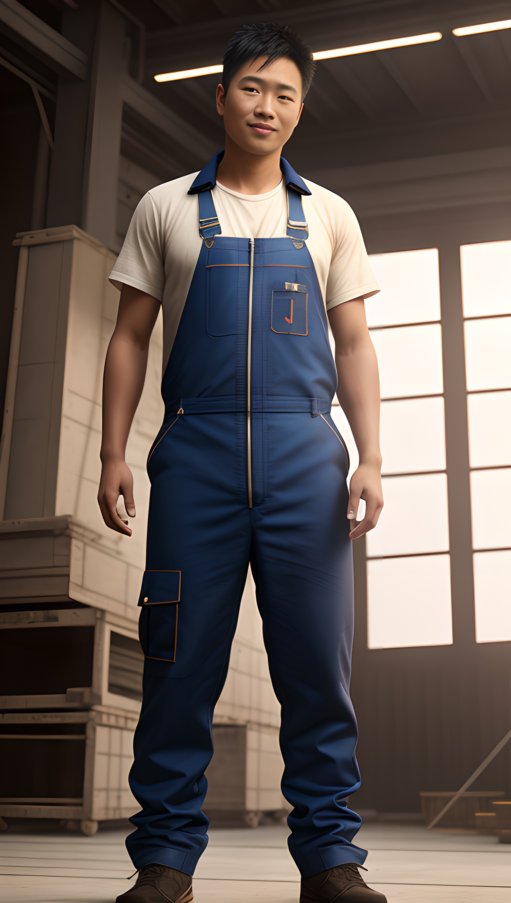

## [013]a male,chinese, wearing suit

Contributed by: [@xutongbao](http://chat.xutongbao.top)

> a male,chinese, wearing suit, smile, using a computer,open eyes,natural skin texture, (full_body:1.4),24mm, 4k textures, soft cinematic light, adobe lightroom, photolab, intricate, elegant, highly detailed, sharp focus (soothing tones:1.25), (hdr:1.25), dramatic, (intricate details:1.14), (hyperrealistic 3d render:1.16), (filmic:0.55), (rutkowski:1.1), (faded:1.3),((((cinematic look)))), insane details, low contrast, exposure blend,(full_body:1.4),

> Negative prompt: (low quality:1.3), (worst quality:1.3),(monochrome:0.8),(deformed:1.3),(malformed hands:1.4),(poorly drawn hands:1.4),(mutated fingers:1.4),(bad anatomy:1.3),(extra limbs:1.35),(poorly drawn face:1.4) (bad_prompt_version2:1.1) (bad-hands-5:1.2) (verybadimagenegative_v1.3:1.2),(deformed, distorted, disfigured:1.3),(unclear eyes:1.331), poorly drawn, bad anatomy, wrong anatomy, extra limb, missing limb, floating limbs, (mutated hands and fingers:1.4), disconnected limbs, mutation, mutated, ugly, disgusting, blurry, amputation

> Steps: 20, Sampler: Euler a, CFG scale: 7, Seed: 2394465936, Face restoration: CodeFormer, Size: 512x910, Model hash: b4391b7978, Model: deliberate_v2

## [014]a beautiful woman, wearing suit

Contributed by: [@xutongbao](http://chat.xutongbao.top)

> <lora:nwsjmajic-10:0.6>,a beautiful woman, wearing suit, smile, using a computer,open eyes,natural skin texture, (full_body:1.4),24mm, 4k textures, soft cinematic light, adobe lightroom, photolab, intricate, elegant, highly detailed, sharp focus (soothing tones:1.25), (hdr:1.25), dramatic, (intricate details:1.14), (hyperrealistic 3d render:1.16), (filmic:0.55), (rutkowski:1.1), (faded:1.3),((((cinematic look)))), insane details, low contrast, exposure blend,(full_body:1.4),

> Negative prompt: (low quality:1.3), (worst quality:1.3),(monochrome:0.8),(deformed:1.3),(malformed hands:1.4),(poorly drawn hands:1.4),(mutated fingers:1.4),(bad anatomy:1.3),(extra limbs:1.35),(poorly drawn face:1.4) (bad_prompt_version2:1.1) (bad-hands-5:1.2) (verybadimagenegative_v1.3:1.2),(deformed, distorted, disfigured:1.3),(unclear eyes:1.331), poorly drawn, bad anatomy, wrong anatomy, extra limb, missing limb, floating limbs, (mutated hands and fingers:1.4), disconnected limbs, mutation, mutated, ugly, disgusting, blurry, amputation

> Steps: 20, Sampler: Euler a, CFG scale: 7, Seed: 2394465936, Face restoration: CodeFormer, Size: 512x910, Model hash: b4391b7978, Model: deliberate_v2

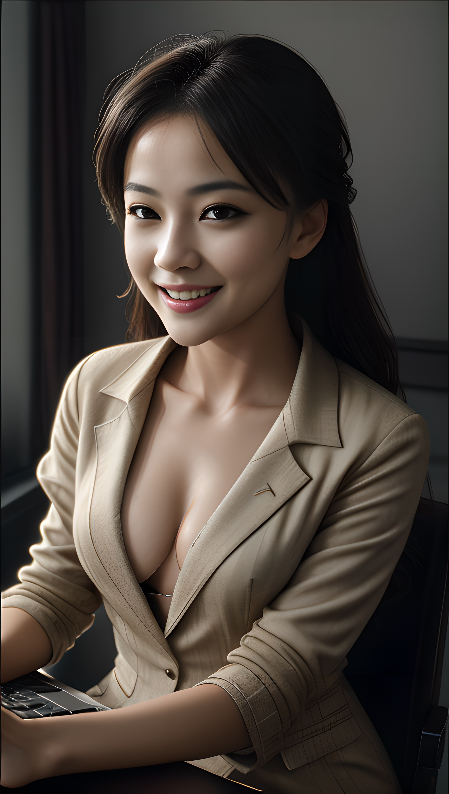

## [015]a beautiful woman, wearing suit

Contributed by: [@xutongbao](http://chat.xutongbao.top)

> <lora:nwsjmajic-10:0.6>, (photorealistic:1.4),8k,a beautiful woman, 26 years old,(masterpiece), best quality, highest quality, (detailed face:1.5),original,highres, unparalleled masterpiece, ultra realistic 8k, perfect artwork, ((perfect female figure)),mature female, milf, narrow waist, skinny,detailed skin, solo, pantyhose, skirt, jacket, school uniform, twintails, white background, bag, shoes, black pantyhose, simple background, black footwear, loafers, blazer, full body, standing, cardigan, plaid, school bag, necktie, pleated skirt, standing on one leg, brown eyes, long hair, black hair, low twintails, sleeves past wrists, long sleeves, plaid skirt, bangs, black jacket, miniskirt, shirt, open clothes, black skirt, collared shirt,high school, school , school gate, street,afternoon,nature light,outdoors, tree, bus stop,200 mm,low position,lens flare

> ng_deepnegative_v1_75t, badhandv4, (worst quality:2), (low quality:2), (normal quality:2), lowres, ((monochrome)), ((grayscale)), watermark,easynegative, paintings, (other hands:1.5), sketches, (worst quality:2), (low quality:2), (normal quality:2), lowres, normal quality, ((monochrome)), ((grayscale)), skin spots, acnes, skin blemishes, age spot, glans,extra fingers,fewer fingers,strange fingers,bad hand,bad eyes,missing legs,extra arms, ((extra legs:1.5)),extra toes,penis,extra limbs,extra vaginal,bad vaginal,Futanari,Man,ugly, fat, anorexic, blur, warping, grayscale, necklace, (piercings), innie, mirror, DAZ 3D, anime, animated, holding, contortion, warped body, spun around,canvas frame, cartoon, 3d, ((disfigured)), ((bad art)), ((deformed)),((extra limbs)),((close up)),((b&w)), wierd colors, blurry, (((duplicate))), ((morbid)), ((mutilated)), [out of frame], extra fingers, mutated hands, ((poorly drawn hands)), ((poorly drawn face)), (((mutation))), (((deformed))), ((ugly)), easynegative

> Steps: 20, Sampler: DPM++ 2M Karras, CFG scale: 7, Seed: 1996503278, Face restoration: CodeFormer, Size: 512x910, Model hash: d819c8be6b, Model: majicmixRealistic_v4

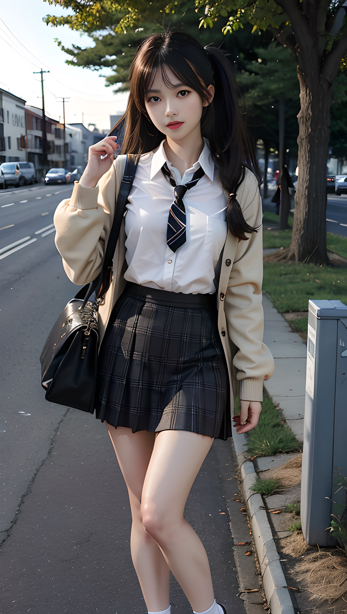

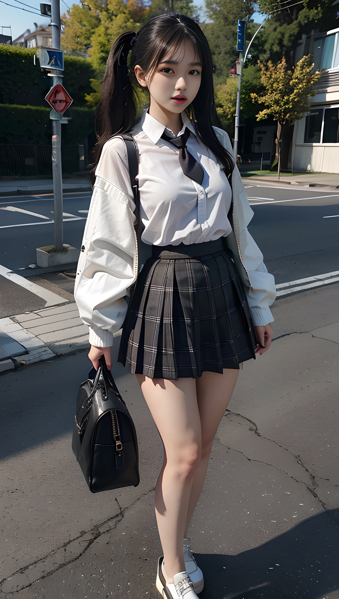
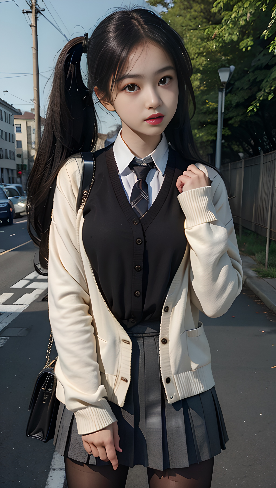

## [016]a girl, wearing a tie

Contributed by: [@xutongbao](http://chat.xutongbao.top)

> a girl, wearing a tie, cupcake in her hands, school, indoors, (soothing tones:1.25), (hdr:1.25), (artstation:1.2), dramatic, (intricate details:1.14), (hyperrealistic 3d render:1.16), (filmic:0.55), (rutkowski:1.1), (faded:1.3)

> Negative prompt: (deformed, distorted, disfigured:1.3), poorly drawn, bad anatomy, wrong anatomy, extra limb, missing limb, floating limbs, (mutated hands and fingers:1.4), disconnected limbs, mutation, mutated, ugly, disgusting, blurry, amputation

> Steps: 20, Sampler: Euler a, CFG scale: 7, Seed: 3451626704, Face restoration: CodeFormer, Size: 512x910, Model hash: b4391b7978, Model: deliberate_v2

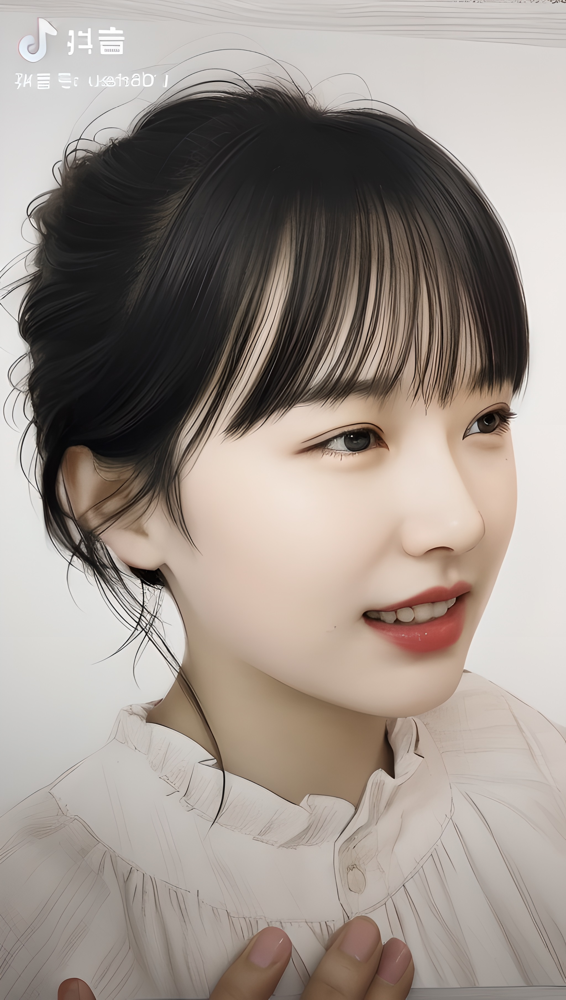

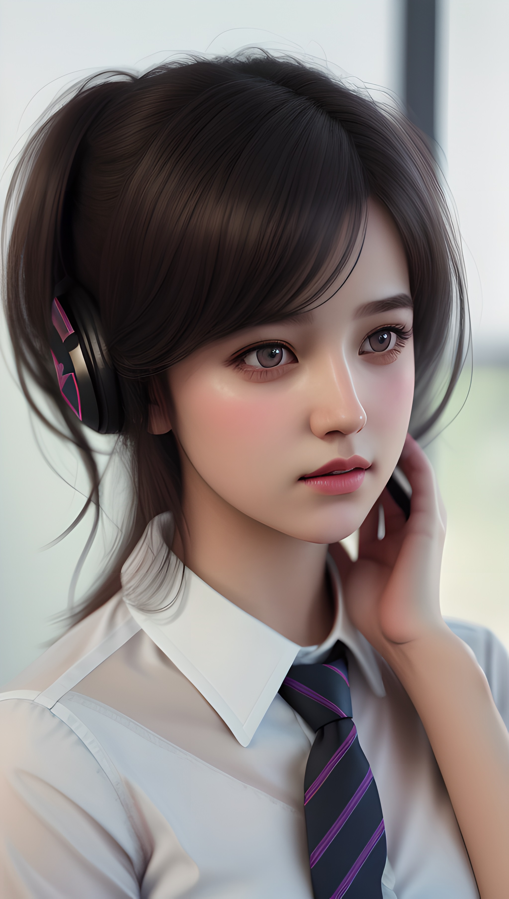
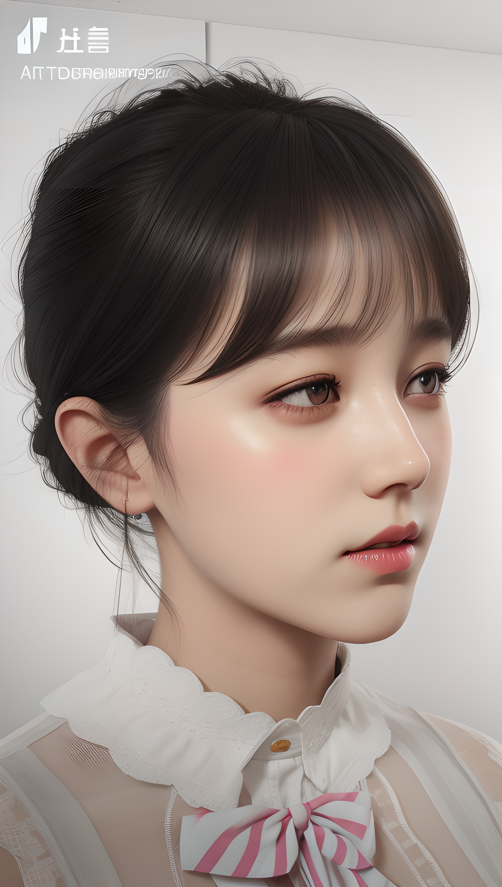
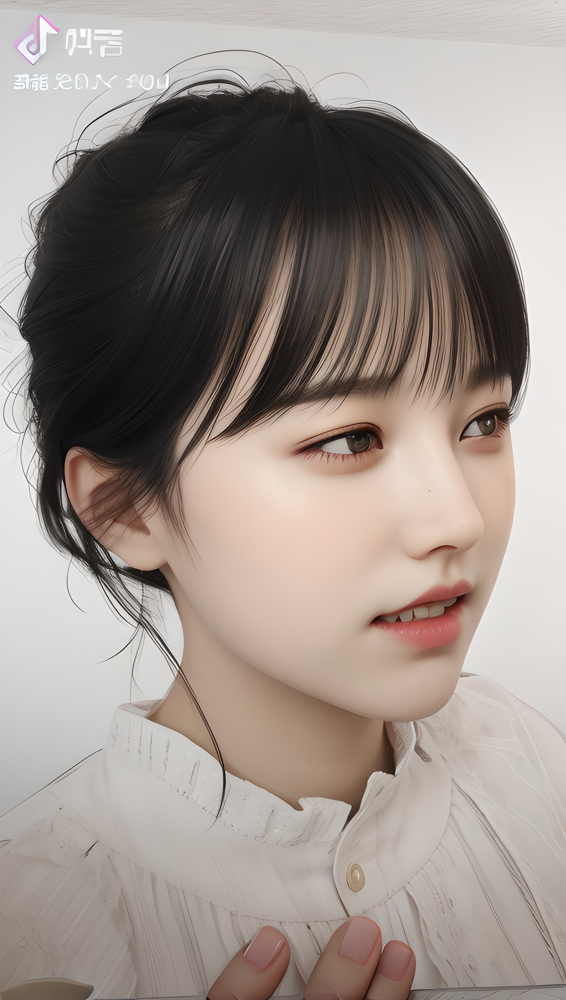
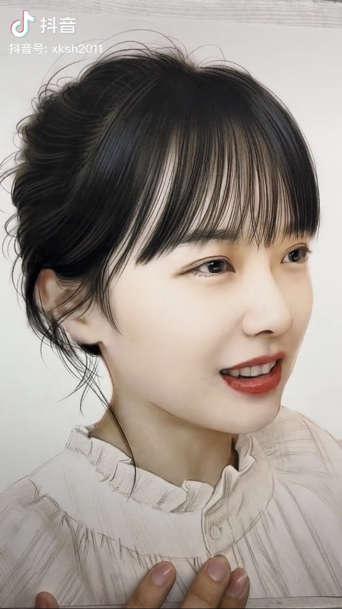

## [017]Asian,(realistic photo shot in a dark studio)

Contributed by: [@xutongbao](http://chat.xutongbao.top)

> Asian,(realistic photo shot in a dark studio), (medium full  body shot), (20 year old girl sexy poses in the gym), sports leggings, sports bra, beautiful detailed face, supermodel, (skinny and fit body:1.1), small breasts, pale skin, detailed long black hair, light 
 makeup, (realistic glistening skin), masterpiece, best quality, high resolution scan, (photo by Canon 5d, 50mm ZEISS lens), hourglass proportions, (8k uhd, hdr, dof), (professionally color graded), sharp focus, rim lighting, dimly lit, two tone lighting, dark,<lora:mix4:0.7>, mix4,

> (bad_prompt_version2:0.8), (worst quality:2), (low quality:2), (normal quality:2), lowres, normal quality, ((monochrome)), ((grayscale)), (sepia), (deformed iris, deformed pupils, semi-realistic, 3d, render, cg, painting, drawing, cartoon, anime, comic:0.6), text, print, signature, logo, watermark, bad_quality, long body, long neck, NG_DeepNegative_V1_75T, easynegative,

> Steps: 20, Sampler: DPM++ 2M Karras, CFG scale: 7, Seed: 2550067498, Face restoration: CodeFormer, Size: 512x910, Model hash: b4391b7978, Model: deliberate_v2

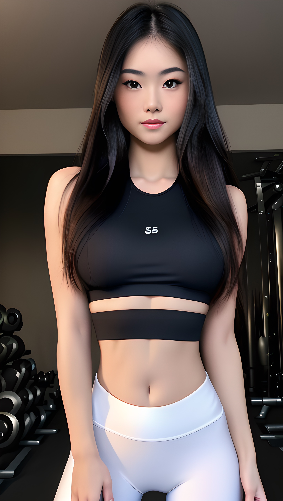

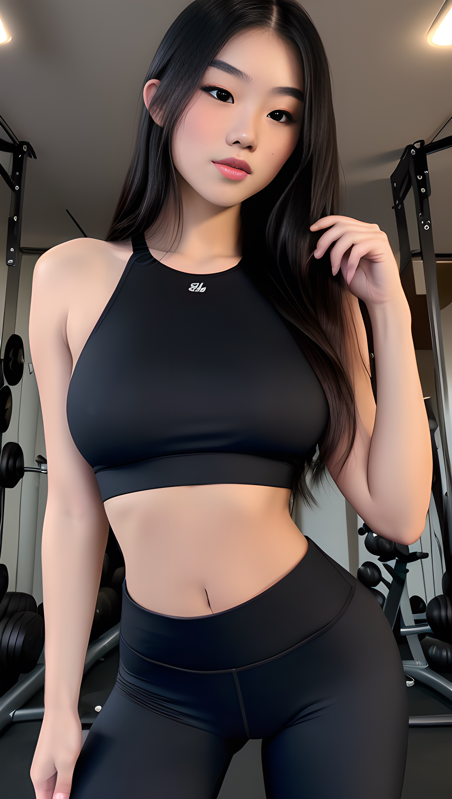

## [018]a girl, wearing a tie

Contributed by: [@xutongbao](http://chat.xutongbao.top)

> Asian,a man,80 years old,gray hair,wrinkle,(soothing tones:1.25), (hdr:1.25), (artstation:1.2), dramatic, (intricate details:1.14), (hyperrealistic 3d render:1.16), (filmic:0.55), (rutkowski:1.1), (faded:1.3),masterpiece, best quality, high resolution scan, (photo by Canon 5d, 50mm ZEISS lens), (8k uhd, hdr, dof), (professionally color graded), sharp focus, rim lighting, dimly lit, two tone lighting, dark

> (deformed, distorted, disfigured:1.3), poorly drawn, bad anatomy, wrong anatomy, extra limb, missing limb, floating limbs, (mutated hands and fingers:1.4), disconnected limbs, mutation, mutated, ugly, disgusting, blurry, amputation

> Steps: 20, Sampler: DPM++ 2M Karras, CFG scale: 7, Seed: 2029464242, Face restoration: CodeFormer, Size: 512x910, Model hash: b4391b7978, Model: deliberate_v2

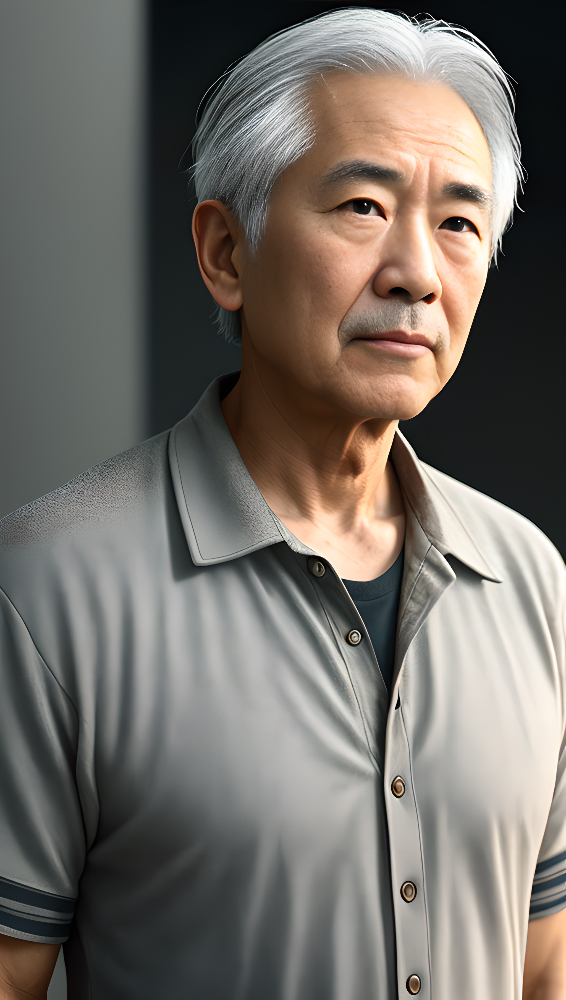

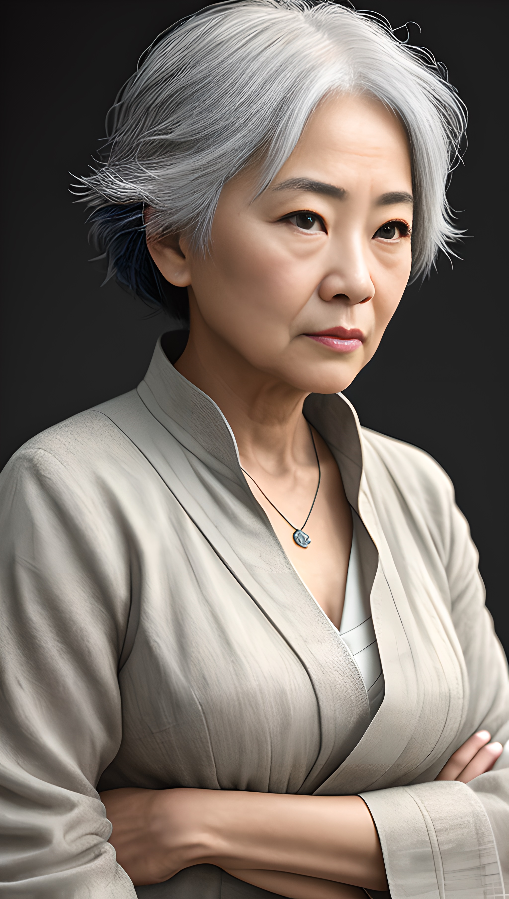

