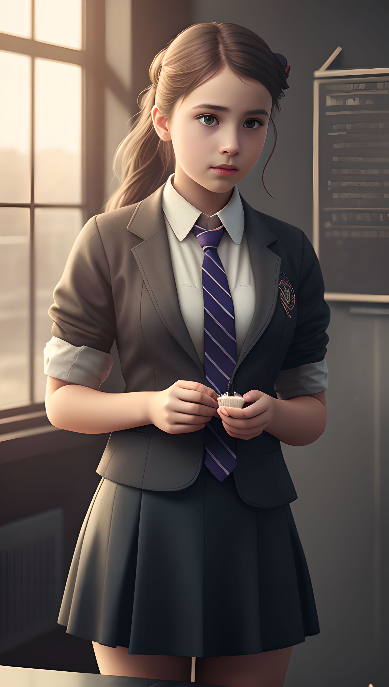
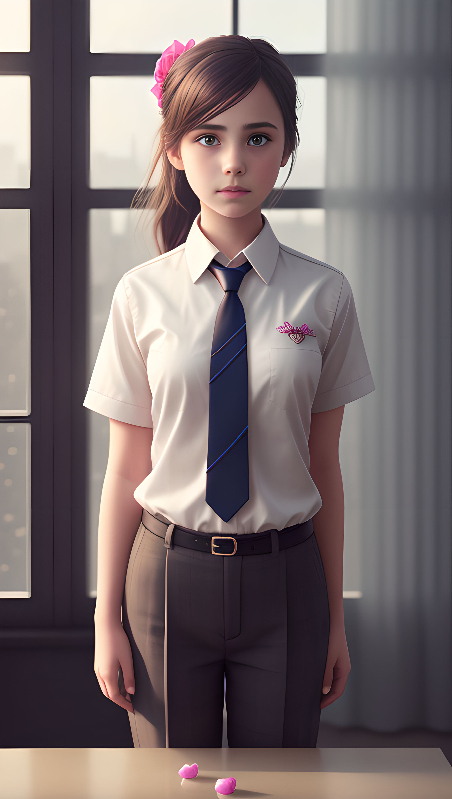
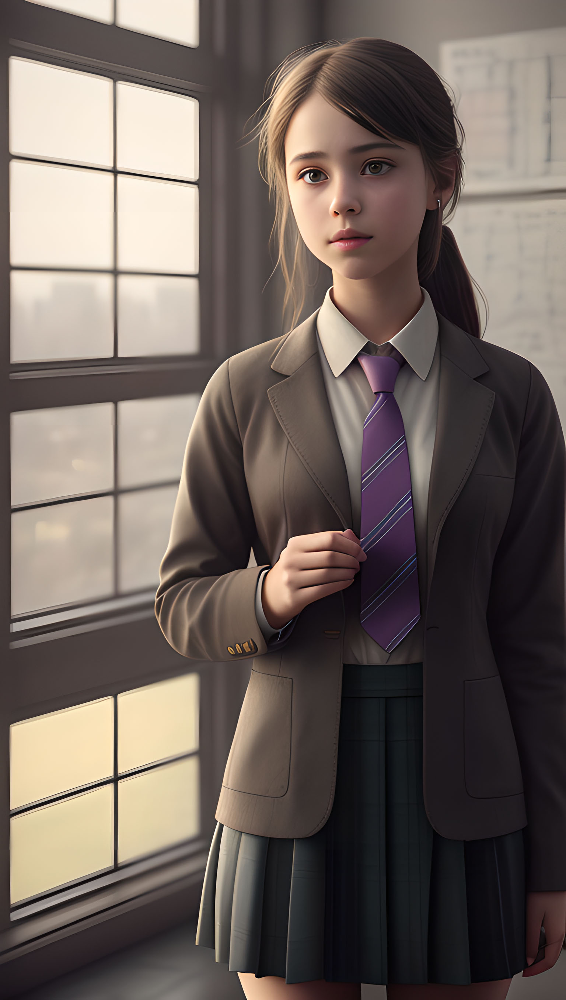

# awesome-stable-diffusion-prompts

# Prompts

## [001]a girl, wearing a tie
Contributed by: [@xutongbao](http://chat.xutongbao.top)

> a girl, wearing a tie, cupcake in her hands, school, indoors, (soothing tones:1.25), (hdr:1.25), (artstation:1.2), dramatic, (intricate details:1.14), (hyperrealistic 3d render:1.16), (filmic:0.55), (rutkowski:1.1), (faded:1.3)
Negative prompt: (deformed, distorted, disfigured:1.3), poorly drawn, bad anatomy, wrong anatomy, extra limb, missing limb, floating limbs, (mutated hands and fingers:1.4), disconnected limbs, mutation, mutated, ugly, disgusting, blurry, amputation
Steps: 20, Sampler: Euler a, CFG scale: 7, Seed: 3451626704, Face restoration: CodeFormer, Size: 512x910, Model hash: b4391b7978, Model: deliberate_v2

